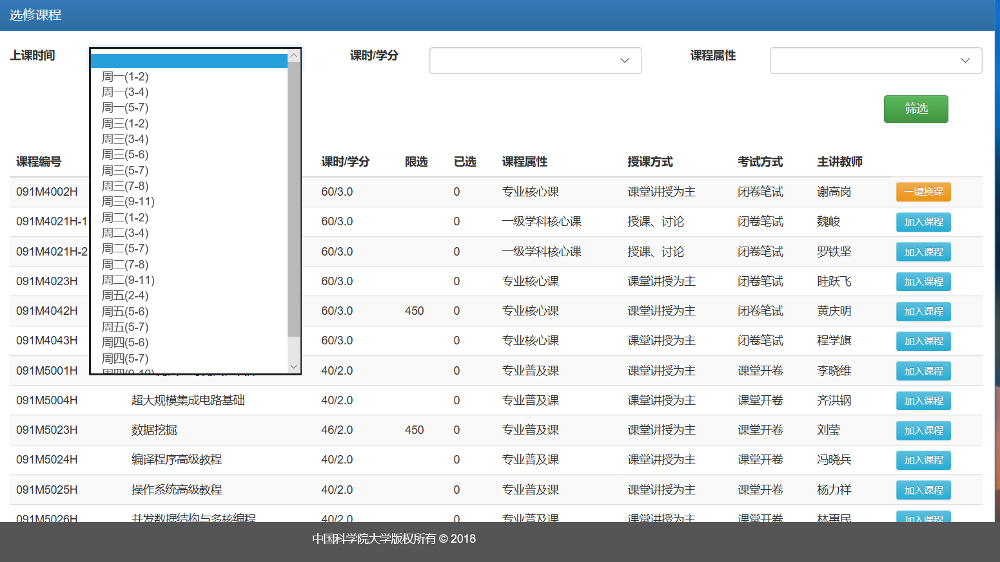
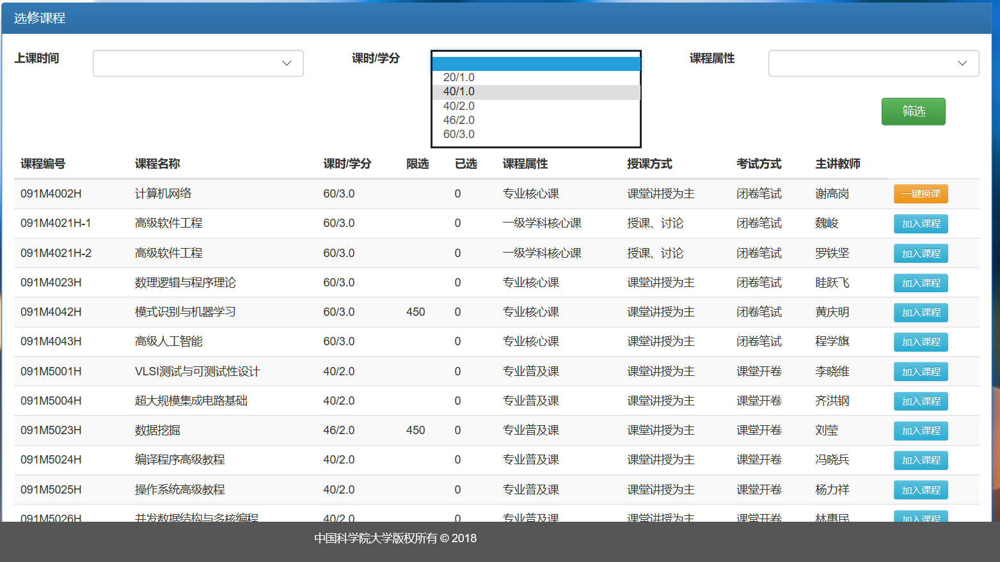
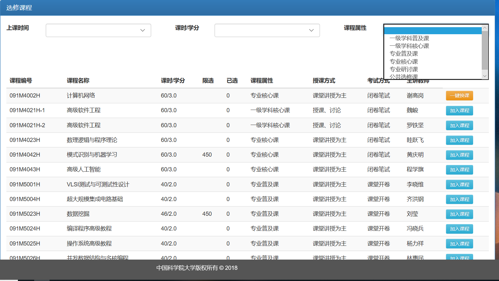
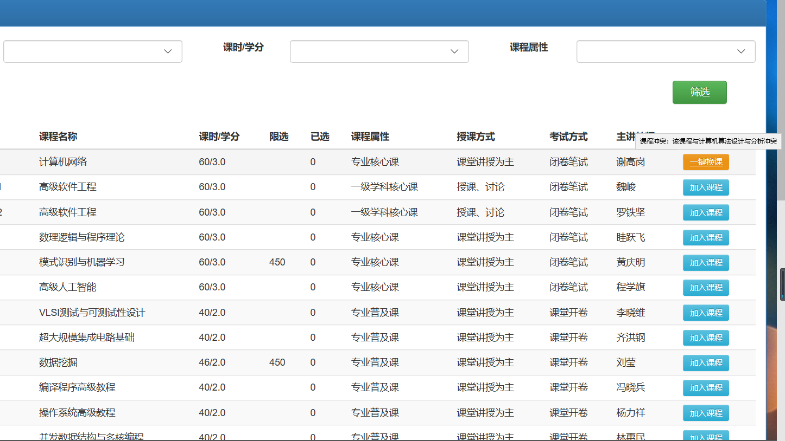
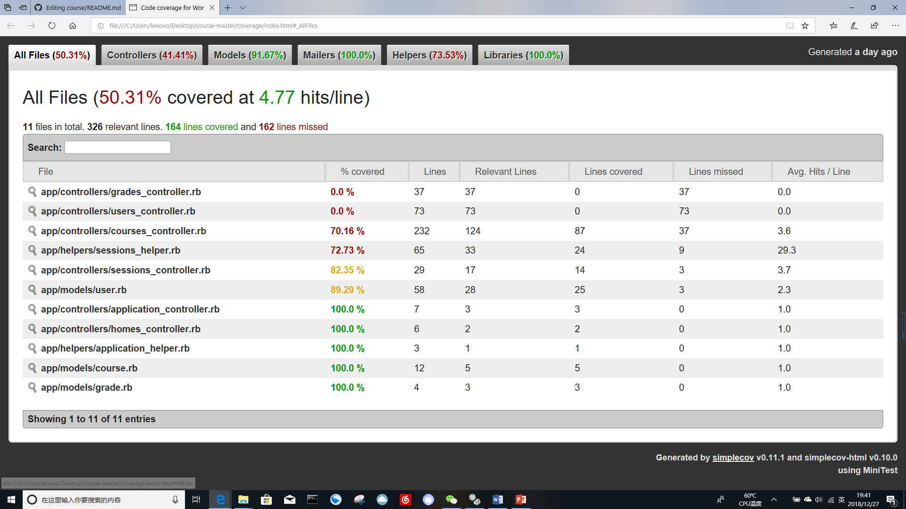

# CourseSelect 

本项目依托于https://github.com/PENGZhaoqing/CourseSelect 进行开发

已在腾讯云上部署，地址http://132.232.248.167:3000/

### 原有功能：

* 多角色登陆（学生，老师，管理员）
* 学生动态选课，退课
* 老师动态增加，删除课程
* 老师对课程下的学生添加、修改成绩
* 权限控制：老师和学生只能看到自己相关课程信息

### 增加功能
* 快速筛选课程
* 学分统计
* 课表查看
* 选课冲突处理

### 截图

  


   


## 说明

目前使用的库和数据库：

* 使用[Bootstrap](http://getbootstrap.com/)作为前端库
* 使用[Rails_admin Gem](https://github.com/sferik/rails_admin)作为后台管理
* 使用[Postgresql](http://postgresapp.com/)作为数据库

使用前需要安装Bundler，Gem，Ruby，Rails等依赖环境。

请根据本地系统下载安装[postgresql](https://devcenter.heroku.com/articles/heroku-postgresql#local-setup)数据库，并运行`psql -h localhost`检查安装情况。


## 安装

在终端（MacOS或Linux）中执行以下代码

```
$ git clone https://github.com/PENGZhaoqing/CourseSelect
$ cd CourseSelect
$ bundle install
$ rake db:migrate
$ rake db:seed
$ rails s 
```

在浏览器中输入`localhost:3000`访问主页

## 使用

1.学生登陆：

账号：`student1@test.com`

密码：`password`

2.老师登陆：

账号：`teacher1@test.com`

密码：`password`


3.管理员登陆：

账号：`admin@test.com`

密码：`password`

账号中数字都可以替换成2,3...等等


## Heroku云部署

项目可直接在Heroku上免费部署

1.fork此项目到自己Github账号下

2.创建Heroku账号以及Heroku app

3.将Heroku app与自己Github下的fork的项目进行连接

4.下载配置[Heroku CLI](https://devcenter.heroku.com/articles/heroku-command-line)命令行工具

5.运行`heroku login`在终端登陆，检查与heroku app的远程连接情况`git config --list | grep heroku`，若未检查到相应的app，请看[这里](http://stackoverflow.com/questions/5129598/how-to-link-a-folder-with-an-existing-heroku-app)

6.运行部署，详情[请戳这里](https://devcenter.heroku.com/articles/getting-started-with-rails4#rails-asset-pipeline)

## 操作指南

### 课程筛选指南：

  学生登陆后可在选课系统内进行选课，通过筛选课程可对课程进行快速筛选，学生可直接对上课时间、学时/学分、课程类型进行筛选，然后点击筛选
  按钮便可查看相应的课程。
  
### 截图

  





### 测试用例代码
```
  test "courses filter1" do
    log_in_as(@user)
    assert_redirected_to controller: :homes, action: :index
    follow_redirect!
    assert_template 'homes/index'
    get list_courses_path
    post list_courses_path, parmas: {'course_time'=>'周五(2-4)', 'course_credit'=>'', 'course_type'=>''}
    assert_response :success 
  end
```

### 选课冲突指南

  学时登陆后在选课界面可以直接看到有冲突的课程，存在冲突的课程不能选择，我们在这里提供了一键换课的功能。通过点击一键换课按钮，能够自动将
  该课程与冲突了的课程进行替换，同时一键换课按钮还提示了与之冲突的课程的详细信息。
  
### 截图



### 课程冲突测试用例
```
  test "courses conflited and swap" do
    log_in_as(@user)
    assert_redirected_to controller: :homes, action: :index
    follow_redirect!
    assert_template 'homes/index'
    get select_course_path(@course1)
    assert_redirected_to courses_path
    assert_not flash.empty?
    get list_courses_path
    assert_select 'td','一键换课'
    get swap_course_path(@course2)
    assert_redirected_to courses_path
    assert_equal '成功换课', flash[:success]
  end
```

## 本地测试

本项目包含了部分的测试（integration/fixture/model test），测试文件位于/test目录下。一键运行所有测试使用`rake test`：

```
PENG-MacBook-Pro:IMS_sample PENG-mac$ rake test
Run options: --seed 15794

# Running:
.........

Finished in 1.202169s, 7.4865 runs/s, 16.6366 assertions/s.

9 runs, 20 assertions, 0 failures, 0 errors, 0 skips
```

### 测试涵盖率检测

我们使用[simplecov](https://github.com/colszowka/simplecov/)库来检测我们编写的测试对于我们的项目是否完整，截图如下



## How to Contribute

先fork此项目，在分支修改后，pull request到主分支

提问请到issues里创建，欢迎contributor！


